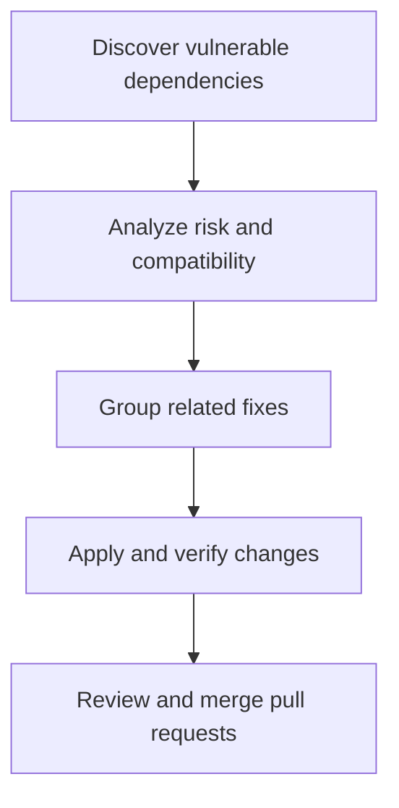
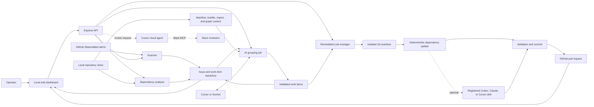

# PatchPilot

**Automated Vulnerability Orchestrator**

PatchPilot is a local-first dashboard for finding, analyzing, and fixing vulnerable dependencies across source repositories. It turns security alerts into a reviewable remediation workflow: triage findings, assess upgrade risk, group compatible fixes, run changes in isolated git worktrees, open pull requests, and monitor CI and review status.

The first implementation adapter targets GitHub Dependabot alerts for JavaScript/npm repositories. The product model is intentionally broader: future ecosystem adapters can add Python (`pip`/Poetry) and Go (`go.mod`) discovery, analysis, and remediation without changing the core issue, work-item, job, worktree, or pull-request workflow.

The main board organizes Dependabot issues into work items. A work item can contain one or more issues, supports drag-and-drop membership while it is a draft, analyzes every member together, and produces one coordinated fix and pull request. **AI auto-group** runs as a visible multi-step job: it refreshes the internal dependency engine for every eligible issue, collects bounded `package.json`, lockfile, import-usage, and dependency-graph evidence, then sends that evidence to Cursor or Gemini for grouping. The v2 planner treats repository text as untrusted data, validates model JSON strictly, repairs one malformed response automatically, safely recovers complete groups from repeated truncation, enforces singleton risk rules and positive compatibility evidence, records server corrections, and atomically replaces eligible draft groups. The UI shows each step (collect issues, dependency analysis, import context, AI grouping, create work items) with live progress. Groups default to at most three issues per work item and are ranked by safety. **Reset work items** clears every work-item record for the selected repository and returns non-terminal members to triage without deleting their Dependabot issue or analysis history. The complete planner contract is in [`AUTO_GROUP_PROMPT_SPECIFICATION.md`](AUTO_GROUP_PROMPT_SPECIFICATION.md).

See [SPECIFICATION.md](SPECIFICATION.md) for the product architecture and the current npm adapter contract.

## Workflow at a glance



## Core workflow architecture



The dashboard is the control plane, while source changes happen only inside isolated worktrees. Deterministic analysis and server-side validation remain authoritative around optional AI grouping, fix assistance, and review notification steps.

## Ecosystem support

| Ecosystem | Alert source | Status |
|---|---|---|
| JavaScript / npm | GitHub Dependabot | Supported now |
| Python / pip and Poetry | Pluggable vulnerability source | Planned |
| Go modules | Pluggable vulnerability source | Planned |

## Setup

```bash
cp .env.example .env
npm install
npm run dev
```

Open `http://localhost:4000`.

## Project selection

Open **Settings** and use **Browse and add project** for each local GitHub clone you want PatchPilot to manage. PatchPilot does not recursively scan a parent folder and does not populate the selector with every repository in your GitHub account. Selecting an added project fills its local clone path and refreshes its supported vulnerability alerts. The current adapter fetches open npm alerts from GitHub Dependabot.

The selected project paths are stored in the gitignored `.orchestrator-settings.json` file. `ORCHESTRATOR_DEFAULT_PROJECT_PATH` can supply one initial project.

The preferred GitHub authentication is the GitHub CLI:

```bash
gh auth login
```

The server automatically uses `gh auth token`. Alternatively, provide an explicit token:

```text
GH_TOKEN=<token with repository and Dependabot alert access>
```

The GitHub token stays in the server process and is never returned to the browser.

## Dependency graph and upgrade verification

The **Dependency analysis** page exposes two independent primary tracks:

1. The local deterministic engine reads the selected npm manifest and nearest workspace `package-lock.json`, builds dependency and peer edges, and calculates a 0–100 safety score for each open vulnerability upgrade.
2. AI analysis uses either Cursor (`@cursor/sdk` with Composer 2.5) or Gemini (Google Generative Language API) to inspect repository usage and produce implementation, breaking-change, and verification guidance without replacing the engine's rating.

Each invocation recomputes its inputs. Issues store separate timestamped histories for dependency-engine, AI analysis, codebase safety-verdict, and final-verification runs (up to 20 per track), plus the latest result for each track. Cursor inspects imports, API usage, configuration, and tests with a read-only tool allowlist and local sandbox enabled. Gemini analyzes pre-collected manifests, lockfile excerpts, import grep hits, and heuristic evidence. Final verification always performs a fresh engine analysis and fresh codebase review before asking the selected provider for an independent verdict.

Choose the provider per run in the UI or with a `provider` field (`cursor` or `gemini`) on AI API requests. When omitted, the server prefers Cursor if `CURSOR_API_KEY` is set, otherwise Gemini.

Configure Cursor AI analysis with:

```text
CURSOR_API_KEY=...
```

The Cursor model is fixed to `composer-2.5` and cannot be overridden by environment configuration.

Configure Gemini AI analysis with:

```text
GEMINI_API_KEY=...
GEMINI_MODEL=gemini-3.6-flash
```

The Cursor SDK requires Node.js 22.13 or later. Graph analysis itself is offline and requires neither Cursor nor Gemini.

The default AI analysis prompt is available and editable on the AI analysis page. Browser edits are stored locally and sent with the analysis request; API keys remain server-side. `AI_UPGRADE_PROMPT_TEMPLATE` can set the server default.

### LLM analysis

Configure an OpenAI-compatible chat-completions endpoint:

```text
LLM_API_KEY=...
LLM_MODEL=...
LLM_BASE_URL=https://api.openai.com/v1
```

`LLM_API_KEY` and `LLM_MODEL` are used only for final independent verification when the Cursor provider is selected. When Gemini is selected for a run, final verification uses `GEMINI_API_KEY` instead. Keys stay in the server process and are never returned to the browser.

## Local remediation

Enter the absolute path to the selected repository clone in the UI, or configure:

```text
ORCHESTRATOR_DEFAULT_PROJECT_PATH=/path/to/clone
```

Fix jobs use `git`, `gh`, Node.js, and npm. Worktrees are created beside the clone under `.dependabot-worktrees`. Optional pre-install and post-lockfile hooks are configured with `REMEDIATION_PRE_INSTALL_SCRIPT` and `REMEDIATION_POST_BUMP_HOOK`.

For Dependabot alerts reported against `package-lock.json` or `npm-shrinkwrap.json`, remediation updates the sibling `package.json` and then regenerates the lockfile with npm. A fix is not considered successful unless its branch contains a commit beyond the remote base branch, and pull-request creation performs the same preflight check before contacting GitHub.

### Agent-assisted fix skills

**Run fix** always starts with a fresh dependency-engine analysis and runs in an isolated worktree. The dialog then lets the user choose one of these workflows:

- **Built-in dependency update** performs the deterministic manifest/lockfile update without an AI coding agent.
- **Codex skill** runs a discovered skill through the official `@openai/codex-sdk` after the dependency update.
- **Claude skill** runs a discovered skill through a configured Claude CLI command.
- **Cursor skill** runs a discovered skill through `@cursor/sdk`.

The selected provider and skill are stored separately on the fix job and on the issue's latest remediation state. The execution order is: fresh engine analysis → isolated worktree → deterministic package bump/install → selected skill → configured validation hook → stage and commit. The agent never owns the commit or push step.

Skills are discovered by provider from:

```text
.agents/skills/<skill>/SKILL.md   # Codex
.claude/skills/<skill>/SKILL.md   # Claude
.cursor/skills/<skill>/SKILL.md   # Cursor
```

The Settings dialog can point Cursor at any directory whose immediate child folders contain `SKILL.md` files. Use **Browse…** to choose that directory, choose a default Cursor remediation skill, and save. Issue and work-item AI fixes then use that saved skill automatically; an explicit API `agent` selection still overrides the default for an individual run.

PatchPilot includes `.agents/skills/dependency-security-fix/SKILL.md` for Codex testing. Codex is enabled by default and uses the local Codex login or `CODEX_API_KEY`; the runner uses `workspace-write`, disables approval prompts, and disables tool network access. Claude remains disabled until explicitly enabled, and Cursor requires `CURSOR_API_KEY`.

```text
CODEX_FIX_ENABLED=true
CODEX_FIX_MODEL=
CLAUDE_FIX_ENABLED=false
CLAUDE_FIX_COMMAND=claude
CURSOR_API_KEY=
FIX_AGENT_SKILLS_ROOT=/optional/project/root
```

The server only accepts provider/skill pairs found in its registry. Disabled providers are visible but cannot be selected, and arbitrary skill paths are rejected.

## Slack through Cursor MCP

Review requests run the `.cursor/skills/send-slack-review/SKILL.md` skill through a **Cursor cloud agent**. Cursor owns the Slack MCP OAuth session on its backend; PatchPilot does not store a Slack bot token or OAuth refresh token.

One-time setup:

1. Open [cursor.com/agents](https://cursor.com/agents), open the **MCP** dropdown, add or enable `https://mcp.slack.com/mcp`, and complete its OAuth flow. This is separate from installing Cursor's regular Slack integration.
2. Configure the server identifier, tool name, and default Slack channel ID:

```text
SLACK_CURSOR_MCP_SERVER=slack
SLACK_CURSOR_MCP_TOOL=slack_send_message
SLACK_DEFAULT_CHANNEL=C0123456789
SLACK_CURSOR_SKILL=.cursor/skills/send-slack-review/SKILL.md
SLACK_CURSOR_TIMEOUT_MS=180000
```

By default, PatchPilot uses the dashboard-managed Slack MCP server authorized at `cursor.com/agents`; it does not replace that server with an inline definition. Use a personal API key belonging to the same Cursor user who authorized Slack MCP because service-account keys cannot reuse a user's OAuth connection.

`SLACK_CURSOR_MCP_URL` and `SLACK_CURSOR_MCP_CLIENT_ID` optionally replace the dashboard server with an inline endpoint and OAuth client. Set `SLACK_CURSOR_AGENT_ID` to a `bc-...` agent ID when Slack was enabled on a specific existing cloud agent; PatchPilot resumes it without overriding its persisted MCP tools. `SLACK_CURSOR_CLOUD_REPO` is optional when creating new agents.

PatchPilot instructs the cloud agent to use only the configured MCP server/tool, requires exactly one successful matching call, and sets `skipReviewerRequest` to avoid reviewer notifications for automated sends. The SDK's local-agent `tools` allowlist is intentionally omitted because Cursor cloud agents do not support that option. If the OAuth session expires, reconnect Slack MCP at [cursor.com/agents](https://cursor.com/agents) before retrying. `POST /api/slack/probe` sends a real, visible test message.

## Commands

```bash
npm test
npm run test:unit
npm run test:integration
npm run test:e2e:github
npm run test:e2e:slack
npm run build
npm start
npm run audit:identifiers
```

## Real GitHub remediation testbed

The real-GitHub end-to-end test is deliberately excluded from ordinary test runs. It clones a dedicated test repository, scans its real open npm Dependabot alerts, uses Gemini to analyze and auto-group them into work items, selects the work item containing the configured alert, applies that work item through the Cursor `dependency-security-fix` skill in an isolated worktree, pushes the generated branch, and opens and verifies one pull request. It then closes the pull request and deletes the generated branch. It never changes the testbed's default branch.

Use a disposable repository whose default branch contains a committed `package.json` and lockfile with a known vulnerable npm dependency. Enable Dependabot alerts and wait for GitHub to create an open alert. The authenticated `gh` account needs read access to Dependabot alerts and write access to repository contents and pull requests. Configure `GEMINI_API_KEY` and `CURSOR_API_KEY` in `.env` or the invoking shell; the test loads `.env` only during an explicit live run.

The test refuses to run unless cleanup is explicitly enabled, and it refuses to touch an existing remediation branch or pull request. Choose an alert that is the first alert number on its PatchPilot issue when multiple manifests are grouped together.

```bash
gh auth status
E2E_GITHUB_REPO=owner/disposable-vulnerability-testbed \
E2E_GITHUB_ALERT=123 \
E2E_GITHUB_CLEANUP=1 \
npm run test:e2e:github
```

Set `E2E_GITHUB_PACKAGE` as an additional assertion when the testbed should remediate a specific package. A failed run may leave a generated `security-fix/dependabot/...` branch if GitHub becomes unavailable during cleanup; inspect and remove only that test-owned branch before retrying.

## Real Slack MCP test

The Slack E2E is excluded from ordinary test runs. It directly invokes the Cursor SDK cloud agent and authenticated Slack MCP server, without starting PatchPilot's server or using its UI. It sends one visible message containing a unique E2E marker. Use a dedicated test channel; the test does not delete its message because the configured MCP server may expose only the send tool.

Authorize Slack at `cursor.com/agents`, put the Cursor and Slack configuration in `.env`, and run:

```bash
E2E_SLACK_CHANNEL=C0123456789 \
E2E_SLACK_SEND=1 \
npm run test:e2e:slack
```

The explicit `E2E_SLACK_SEND=1` acknowledgement prevents accidental external messages. Success verifies the isolated `Vitest → Cursor SDK cloud agent → Slack MCP → Slack channel` path. Check the dedicated channel to confirm the message visually.

Set `E2E_CURSOR_RUNTIME=local` to test a local Cursor SDK agent instead. Local mode loads project, user, and plugin MCP settings from Cursor Desktop and remains independent of PatchPilot's API and UI.

Set `E2E_CURSOR_AGENT_ID=bc-...` to resume and test a specific existing Slack-enabled cloud agent instead of creating a new one.

Set `E2E_CURSOR_MCP_SOURCE=dashboard` to omit inline MCP configuration and verify that a new cloud agent inherits the user's or team's server from `cursor.com/agents`.

`npm run build` emits `dist/server.js`; `npm start` serves the compiled API and the static web UI.

## Security

Tokens remain server-side. Hook paths are trusted operator configuration. `.tracker-state.json`, `.env*`, reports, worktrees, and build output are gitignored. State imports are shape-validated and persistence uses serialized atomic writes.
