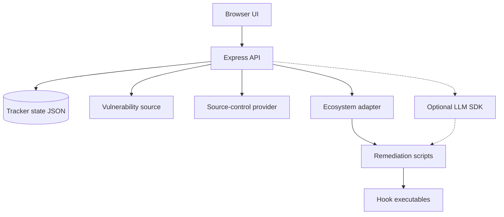

# PatchPilot — automated vulnerability orchestrator specification

**Version:** 1.1
**Audience:** Engineers or AI agents building an equivalent system from scratch
**Product scope:** Automated dependency-vulnerability discovery, analysis, remediation, and pull-request orchestration
**Version 1 adapter:** JavaScript dependency alerts reported by GitHub under the `npm` ecosystem
**Constraint:** This document must not name a specific employer, customer, or proprietary internal toolchain. Examples use placeholders only (`owner/repo`, `example-org/example-app`).
**Hygiene:** Before publishing, scan this document and generated artifacts for real hostnames, employee paths, internal ticket keys, and organization-scoped GitHub owners.

## 1. Purpose

### 1.1 Problem

Vulnerability scanners can identify dependency risks and may open pull requests, but teams still struggle to:

- See alert volume, triage state, and remediation progress in one place.
- Repeat the same local steps—clone or worktree, bump, install, optional code generation, commit, and PR—for many alerts.
- Judge upgrade risk, including transitive dependencies, semver changes, peer conflicts, and lockfile conflicts.
- Batch compatible fixes without combining incompatible manifests.
- Track CI, reviews, and handoffs after PRs are opened.

### 1.2 Solution

A local-first, ecosystem-neutral orchestrator that:

1. Ingests findings from vulnerability-source adapters and groups them into remediation issues.
2. Persists triage state in a kanban-style workflow.
3. Dispatches fixes to ecosystem-specific remediation adapters in local git worktrees.
4. Rates upgrades with a deterministic dependency graph, optionally vets code usage through the Cursor SDK, and independently verifies the combined evidence with an LLM.
5. Batches compatible fixes from the same ecosystem.
6. Tracks PRs and worktrees, and sends Slack review pings.

The configured scanner and source-control provider remain the source of truth for findings and PRs. PatchPilot does not replace organization security policy or perform unattended production deployments. Version 1 uses GitHub Dependabot as its vulnerability source and GitHub as its source-control provider.

### 1.3 Version 1: JavaScript/npm adapter

Version 1 targets:

- GitHub Dependabot alerts whose `dependency.package.ecosystem` is `npm`, case-insensitively.
- Dependencies declared in `package.json`.
- npm installation and `package-lock.json` refresh.
- A repository with one or more JavaScript manifest directories.

Yarn, pnpm, Bun, and non-JavaScript ecosystems are future extension points. Unsupported alerts must be ignored during ingestion rather than converted into actionable tracker issues.

### 1.4 Version 1 non-goals

- Implementing Python, Go, or other non-`npm` remediation adapters in version 1. These are planned extension points, not product-level non-goals.
- Supporting Yarn, pnpm, or Bun remediation in version 1.
- Replacing Dependabot or GitHub Advanced Security.
- Building a centralized multi-tenant SaaS; the default deployment is a single developer laptop.
- Hard-coding a company-specific registry login, code-generation step, or monorepo layout. Use hooks instead.
- Guaranteeing a merge without human review.

## 2. Architecture

| Layer | Responsibility | Typical technology |
|---|---|---|
| Web UI | Board, issue drawer, batch UI, PR watch, package update, and worktree cleanup | Static HTML/JS served by Express |
| HTTP API | GitHub authentication, state operations, and async job spawning; never exposes secrets to the browser | Express and TypeScript |
| Domain state | Issues, batches, fix jobs, and PR watch lists | In-memory repository with JSON persistence |
| Vulnerability source adapter | Normalizes scanner findings into remediation issues | GitHub Dependabot in version 1 |
| Source-control provider | Repositories, PRs, checks, and labels | GitHub REST API in version 1 |
| Ecosystem adapter | Manifest inspection, dependency graph analysis, and package updates | npm in version 1 |
| Remediation runtime | Ecosystem tools, scripts, git worktrees, and provider CLI | Local child processes |
| Optional AI | Upgrade-risk narrative and optional agent-driven fixes | Pluggable local LLM/agent SDK |
| Optional integrations | Slack | Environment-configured adapter |

### 2.1 Trust boundaries



- The UI communicates only with the local API.
- Fix scripts run as the same operating-system user as the server and require access to `git`, `gh`, npm, and local clones.
- `GH_TOKEN`, LLM API keys, and optional integration tokens remain server-side.

### 2.2 Process model

- Scan and read paths are synchronous HTTP operations.
- Fix, batch fix, and package update operations are asynchronous jobs.
- The API returns a `jobId`; the UI polls the corresponding job endpoint approximately every two seconds.
- Optional AWS SSO validation runs in the API before a remediation job starts.

### 2.3 Adapter extension model

The core workflow must not assume a package manager. New ecosystems plug into three boundaries:

| Boundary | Required behavior |
|---|---|
| Vulnerability source | Fetch findings and normalize advisory, package, severity, vulnerable range, patched version, and affected manifest data |
| Ecosystem analyzer | Identify manifests and lockfiles, build a dependency graph, assess compatibility, and provide verification guidance |
| Ecosystem remediator | Update dependency declarations, refresh lockfiles, run validation, and return structured job results |

Every normalized issue carries an `ecosystem` identifier. Batches contain issues handled by one compatible ecosystem adapter. Shared orchestration—including state transitions, AI prompts, worktrees, jobs, PR tracking, and notifications—remains independent of npm, Python, or Go.

The intended next adapters are Python (`pip`/Poetry with `requirements*.txt` or `pyproject.toml`) and Go modules (`go.mod`/`go.sum`). Adding them requires adapter implementations and tests, not a second workflow or separate UI.

## 3. Core domain model

### 3.1 Issue workflow

The supported states are:

- `NEW`
- `TRIAGED`
- `PLANNED_BATCH`
- `IN_PROGRESS`
- `READY_FOR_REVIEW`
- `MERGED`
- `RESOLVED`
- `BLOCKED`
- `CLOSED`

Allowed transitions:

```text
NEW -> TRIAGED, BLOCKED, CLOSED
TRIAGED -> PLANNED_BATCH, BLOCKED, CLOSED
PLANNED_BATCH -> IN_PROGRESS, TRIAGED, BLOCKED, CLOSED
IN_PROGRESS -> READY_FOR_REVIEW, BLOCKED, CLOSED
READY_FOR_REVIEW -> MERGED, RESOLVED, BLOCKED, CLOSED
MERGED -> CLOSED
RESOLVED -> CLOSED
BLOCKED -> TRIAGED, NEW, CLOSED
CLOSED -> terminal
```

Implement transitions as an adjacency map. Reject invalid moves unless the API receives `force: true`. Append an entry to `history[]` for every actual transition with `at`, `from`, `to`, `actor`, and optional `note`.

### 3.2 Remediation issue

One remediation issue groups normalized vulnerability findings when they share:

- ecosystem (`npm`)
- package name
- first patched version

The stable ID is `issue-{slug}`, where the slug is derived from `npm|packageName|patchedVersion`, lowercased, with unsafe characters replaced by hyphens.

Required fields:

| Field | Description |
|---|---|
| `id` | Stable tracker identifier |
| `repo` | `owner/name` |
| `title` | Human-readable summary |
| `state` | Workflow state |
| `alerts` | Source finding identifiers; GitHub Dependabot alert numbers in version 1 |
| `packageName` | Ecosystem package name |
| `ecosystem` | Adapter identifier; `npm` in version 1 |
| `manifestPath` | Affected dependency manifest; `package.json` in version 1 |
| `patchedVersion` | First patched version |
| `vulnerableVersionRange` | Advisory range |
| `severity`, `severityScore`, `complexity` | Sorting and filtering metadata |
| `pr.branch` | Expected remediation branch |
| `remediation` | Job ID, log, worktree path, result, and errors |
| `lastUpgradeAnalysis`, `lastAiAnalysis` | Optional analysis results |
| `jira` | Optional issue link |
| `history`, `notes`, `labels` | Audit trail and annotations |

If matching alerts span multiple manifest paths, retain all relevant alert numbers and record the primary manifest deterministically. A production implementation should expose all affected manifests rather than silently discarding them.

### 3.3 Work item

| Field | Description |
|---|---|
| `id` | Unique work-item ID |
| `repo` | `owner/name` |
| `issueIds` | One to ten Dependabot issue IDs |
| `state` | `draft -> fixing -> ready_for_pr -> pr_open -> merged / failed` |
| `branch` | Default `security-fix/dependabot/batch/{workItemId}`; the legacy path remains stable |
| `remediation` | Same result/log shape used by issues |
| `grouping` | Group source, rationale, requested maximum size, analysis timestamp, and optional AI safety rank, score, level, summary, and model |

Work-item rules:

- Every member must use the same active ecosystem adapter.
- A work item may contain one issue so risky, unanalyzed, or otherwise incompatible dependencies can remain isolated.
- Draft work items support moving Dependabot issues between work items and back to an unassigned pool.
- Analyze runs for every member. Fix is blocked while any member is unanalyzed, risky, unsafe, or requires additional coordinated bumps.
- Members may share a worktree but must be updated in their correct manifest directories.
- Run one npm install per distinct manifest directory.
- Reject or explicitly warn about members whose analysis reports `risky` or `unsafe`, or `needsAdditionalBumps: true`.
- One work item creates one commit and, when requested, one PR.
- AI auto-grouping runs as an asynchronous grouping job (`POST .../work-items/auto-group` returns `202`; poll `GET /grouping-jobs/:jobId`). Before calling the model, the server always re-runs deterministic dependency analysis and import scanning for every eligible issue, persists `lastUpgradeAnalysis`, and builds an evidence payload containing deduplicated `package.json` files, per-package lockfile excerpts, import usage, findings, and a merged dependency graph.
- The selected provider (`cursor` or `gemini`) receives that evidence plus the eligible issue list. It defaults to at most three members and accepts an operator-selected limit from two to ten.
- The UI must show every grouping job step and per-issue progress while the job runs.
- The server rejects unknown and duplicate issue IDs, splits cross-ecosystem or oversized proposals, assigns omitted issues to singleton fallbacks, and persists the model's normalized safety ranking.
- Re-running auto-grouping may replace AI or dependency-engine draft groups, but must preserve manual and in-progress groups. A failed model call must leave existing groups unchanged.

### 3.4 Fix job

A fix job contains:

- `id`
- `kind`: `fix`, `create-pr`, `update-pr`, `reset-pr-and-fix`, `batch-fix`, `batch-create-pr`, or `package-update`
- `status`: `queued`, `running`, `succeeded`, or `failed`
- optional `issueId` or `batchId`
- `repo`
- optional primary `alertNumber`
- streamed `log`
- parsed `result`: branch, commit SHA, worktree path, PR URL, and package versions
- timestamps and optional error

Job completion must update the corresponding issue or batch remediation record. Active or completed jobs needed after restart must be persisted or recoverable from tracker state.

## 4. GitHub ingestion

### 4.1 Scan API

`POST /api/repos/:owner/:repo/scan`:

1. Fetches open Dependabot alerts with pagination.
2. Keeps only alerts whose ecosystem is `npm`.
3. Groups supported alerts according to section 3.2.
4. Upserts tracker issues. Existing IDs preserve workflow state, history, notes, PR data, analysis, and remediation data.
5. Marks an existing issue `CLOSED` when none of its tracked alerts remain open, unless local policy chooses a different terminal-state mapping.
6. Returns `alertCount`, `issueCount`, `openPrCount`, and `scannedAt`.

`alertCount` and `issueCount` refer to supported JavaScript alerts and their resulting groups. Unsupported ecosystems are not actionable.

### 4.2 Branch and worktree naming

Issue branch:

```text
security-fix/dependabot/{manifestSlug}/npm/{packageSlug}-{patchedSlug}
```

Slugging lowercases text, replaces unsafe characters with `-`, and prevents `.lock` from appearing in branch components.

Issue worktree:

```text
{parentOfClone}/.dependabot-worktrees/{repoSlug}-alert-{alertNumber}
```

Batch worktree:

```text
{parentOfClone}/.dependabot-worktrees/{repoSlug}-batch-{batchId}
```

## 5. JavaScript remediation pipeline

### 5.1 Hooks

Organization-specific behavior must be configured through hooks:

| Environment variable | Execution point |
|---|---|
| `REMEDIATION_PRE_INSTALL_SCRIPT` | In the worktree before `npm install` |
| `REMEDIATION_POST_BUMP_HOOK` | After lockfile refresh and before commit |
| `REMEDIATION_REQUIRE_AWS_SSO` | When true, fixes return HTTP 412 until AWS SSO is valid |
| `AWS_SSO_PROFILE` | Profile used by `aws sts get-caller-identity` |

`--skip-origin` skips the post-bump hook. The legacy flag name is retained for compatibility.

The API passes hook paths plus `DEPENDABOT_FIX_REPO_ROOT` and `GITHUB_REPOSITORY` to child processes.

### 5.2 Single-alert fix

Script interface:

```text
dependabot-issue-fix.sh fix OWNER/REPO ALERT_NUMBER [options]
```

Required flow:

1. Fetch the alert through `gh api` and reject it unless the ecosystem is `npm`.
2. Resolve the main clone from `--repo-root` or `DEPENDABOT_FIX_CACHE_ROOT`.
3. Create or reuse a worktree on the expected branch.
4. Update the direct dependency range or npm override as appropriate.
5. Run the pre-install hook.
6. Run `npm install` in the manifest directory, respecting `.nvmrc` or `engines.node` where practical.
7. Run the post-bump hook unless `--skip-origin` is set.
8. Commit the changes.
9. Optionally push and create or reuse a GitHub PR.
10. Print machine-readable `branch:`, `commit:`, `worktree_path:`, and optional `pr_url:` lines.

Create PR without re-bumping:

```text
--reuse-worktree --skip-fix --push --open-pr
```

Reset branch:

```text
--reset-to-base --push
```

### 5.3 Batch fix

`dependabot-batch-fix.sh` accepts comma-separated alert numbers through `--alerts` and a required `--batch-id`.

It must:

- Use one worktree.
- Apply every selected JavaScript bump.
- Run one npm install per distinct manifest directory after all bumps for that directory.
- Run configured hooks at the documented lifecycle points.
- Create one commit and optionally one PR.
- Support `--continue-on-error`, `--fail-fast`, `--skip-fix`, and `--skip-origin`.
- Report individual failures in the job log.

### 5.4 Ad-hoc package update

`package-json-update.sh fix|refresh-github` updates a JavaScript dependency without requiring a Dependabot alert. Direct dependencies must be updated directly rather than added as new npm overrides.

The API starts an asynchronous job at:

```text
POST /api/repos/:owner/:repo/package-updates
```

The UI polls:

```text
GET /api/package-update-jobs/:jobId
```

### 5.5 UI action mapping

| UI action | Job kind | Script behavior |
|---|---|---|
| Run fix | `fix` | Full bump, install, hook, and commit |
| Create PR | `create-pr` | Reuse existing worktree when appropriate; push and open/reuse PR |
| Re-run fix and push | `update-pr` | `--reuse-worktree --push` |
| Reset PR and fix | `reset-pr-and-fix` | `--reset-to-base --push` |
| Run batch fix | `batch-fix` | Batch script |
| Create batch PR | `batch-create-pr` | `--skip-fix --push --open-pr` |

Shell scripts are the default remediation path. Agent mode is used only when `useAgent: true` and a configured server-side LLM API key is present.

### 5.6 Success detection

Treat a script as successful when:

- Its exit code is zero, or
- Its output indicates that it is continuing to push/create a PR, or
- Its output contains `No new commit (fix already applied)`.

Parse results from either a JSON result blob or documented `key: value` output lines.

## 6. HTTP API catalog

### 6.1 Config, health, issues, and scan

- `GET /api/health`
- `GET /api/config/defaults`
- `GET /api/repos/:owner/:repo/issues`
- `GET /api/repos/:owner/:repo/status`
- `POST /api/repos/:owner/:repo/scan`
- `POST /api/issues/:id/state`
- `POST /api/issues/:id/notes`

### 6.2 Remediation

- `POST /api/issues/:id/actions/fix`
- `GET /api/fix-jobs/:jobId`
- `POST /api/issues/:id/actions/create-pr`
- `POST /api/issues/:id/actions/update-pr`
- `POST /api/issues/:id/actions/reset-pr-and-fix`
- `GET /api/remediation/aws-status`
- `POST /api/remediation/aws-sso-login`

### 6.3 PR and CI

- `GET /api/issues/:id/pr-status`
- `POST /api/issues/:id/actions/associate-pr`
- `POST /api/issues/:id/actions/close-pr`
- `POST /api/issues/:id/actions/apply-pr-labels`
- `GET /api/repos/:owner/:repo/pull-requests`
- `POST /api/repos/:owner/:repo/pull-requests/refresh`
- `POST /api/repos/:owner/:repo/pull-requests/:number/close`

### 6.4 Batches

- `POST /api/repos/:owner/:repo/batches`
- `GET /api/repos/:owner/:repo/batches`
- `GET /api/batches/:batchId`
- `POST /api/batches/:batchId/actions/fix`
- `POST /api/batches/:batchId/actions/create-pr`
- `POST /api/repos/:owner/:repo/batches/compose-from-tracker`
- `POST /api/repos/:owner/:repo/batches/compose`
- `POST /api/repos/:owner/:repo/batches/actions/clear`
- `POST /api/repos/:owner/:repo/work-items`
- `GET /api/repos/:owner/:repo/work-items`
- `POST /api/repos/:owner/:repo/work-items/auto-group` (returns `202` with grouping job id)
- `GET /api/grouping-jobs/:jobId`
- `POST /api/repos/:owner/:repo/work-items/move-issue`
- `POST /api/repos/:owner/:repo/work-items/actions/reset`
- `POST /api/work-items/:workItemId/analyze`
- `POST /api/work-items/:workItemId/actions/fix`
- `POST /api/work-items/:workItemId/actions/create-pr`

### 6.5 Analysis

- `POST /api/issues/:id/analyze-upgrade`
- `POST /api/issues/:id/analyze-upgrade/ai`
- `POST /api/repos/:owner/:repo/analyze-upgrade/bulk`
- `GET /api/analysis/prompt-template`
- `GET /api/work-items/grouping-prompt`

### 6.6 Package manifest UI

- `GET /api/package-manifest`
- `POST /api/repos/:owner/:repo/package-updates`
- `GET /api/package-update-jobs/:jobId`

### 6.7 Worktrees

- `GET /api/repos/:owner/:repo/worktrees`
- `DELETE /api/repos/:owner/:repo/worktrees/:worktreeId`
- `POST /api/repos/:owner/:repo/worktrees/bulk-delete`

### 6.8 Optional Slack integration

- `GET /api/slack/status`
- `POST /api/slack/probe`
- `POST /api/issues/:id/slack-review-request`

### 6.9 State operations

- `GET /api/state/export`
- `POST /api/state/import`
- `POST /api/state/save`
- Snapshot list, create, and restore operations

## 7. Persistence

The default repository uses in-memory maps serialized to `.tracker-state.json` after changes. It persists:

- Issues keyed by `owner/name`
- Batches
- Jobs or sufficient remediation state to recover their final results
- PR watch entries
- Optional snapshots under `tracker-state/` or `reports/`

Writes should be serialized or atomic to prevent concurrent jobs from corrupting the JSON file. Imported state must be schema-validated before replacing active state.

Tracker state and local exports must remain gitignored.

## 8. Web UI

Minimum pages:

| Route | Purpose |
|---|---|
| `/` | Kanban board, scanning, filters, issue drawer, remediation actions, and fix-log polling |
| `/ai-upgrade-analysis.html` | Bulk AI analysis with progress |
| `/package-update.html` | Manifest picker and package-update jobs |
| `/prs.html` | Linked/open JavaScript security PRs and CI status |
| `/worktrees.html` | List and delete remediation worktrees |

The board must display every workflow state, including `MERGED` and `RESOLVED`.

On load, the UI may fetch `/api/config/defaults` and persist user overrides in `localStorage` as `dt_repo` and `dt_project_path`. Show the AWS banner only when `remediationRequireAwsSso` is true.

The UI must provide a Settings control for a local repositories root. Saving the root scans nested directories for git clones with a GitHub `origin`, exposes the discovered `owner/repo` values in the repository selector, and automatically fills the selected clone path. Selecting a repository refreshes its open npm Dependabot alerts.

## 9. Upgrade analysis

### 9.1 Heuristic analysis

Input consists of a tracker issue and local project path containing the relevant `package.json` and lockfile.

Output contains:

- `riskLevel`: `safe`, `likely_safe`, `risky`, or `unsafe`
- `needsAdditionalBumps`
- findings such as peer conflicts, version gaps, direct/transitive status, and lockfile constraints
- a dependency graph with nodes and edges suitable for UI rendering

### 9.2 AI analysis

The primary AI path supports two providers selected per request: `cursor` or `gemini`.

- **Cursor** runs through `@cursor/sdk` using the fixed `composer-2.5` model. The model is not operator-configurable. It gives Cursor read-only repository tools inside its local sandbox and supplies the package, target version, manifest context, and dependency graph.
- **Gemini** runs through the Google Generative Language API using `GEMINI_API_KEY` and `GEMINI_MODEL` (default `gemini-3.6-flash`). It analyzes pre-collected repository context: manifests, lockfile excerpts, bounded import grep hits, and optional heuristic analysis.

Both providers return a summary, remediation steps, breaking changes, and verification checks while recording provider, model, duration, and source-analysis timestamp. API keys remain server-side. When `provider` is omitted, the server prefers Cursor if configured, otherwise Gemini.

Final verification with the Cursor provider uses the independent OpenAI-compatible `LLM_*` configuration. Final verification with the Gemini provider uses `GEMINI_API_KEY`.

### 9.3 Analysis in batching

AI auto-grouping always refreshes deterministic analysis and import context for every eligible issue before calling the model. The payload includes deduplicated `package.json` manifests, per-package lockfile excerpts, import usage hits, findings, per-issue dependency subgraphs, and a merged repository dependency graph. The selected provider (`cursor` or `gemini`) proposes groups of up to the requested size and ranks them from safest to least safe. Server-side normalization enforces membership, uniqueness, ecosystem, and size constraints and creates singleton fallbacks for omitted issues. Fix validation still rejects work items containing unresolved risky, unsafe, unanalyzed, or coordinated-bump members.

The versioned planner contract, proposed v2 prompt, current-gap analysis, and acceptance criteria are defined in [`AUTO_GROUP_PROMPT_SPECIFICATION.md`](AUTO_GROUP_PROMPT_SPECIFICATION.md).

## 10. Environment variables

| Variable | Required | Purpose |
|---|---|---|
| `GH_TOKEN` | Optional fallback | Explicit GitHub token; when absent, use the authenticated `gh` CLI token |
| `PORT` | No | HTTP port; default 4000 |
| `ORCHESTRATOR_DEFAULT_REPO` | No | Default `owner/repo` |
| `ORCHESTRATOR_DEFAULT_PROJECT_PATH` | No | Default local clone |
| `GITHUB_REPOSITORIES_ROOT` | No | Initial parent directory for automatic local GitHub clone discovery |
| `UPGRADE_ANALYSIS_PROJECT_PATH` | No | Analysis clone fallback |
| `DEPENDABOT_FIX_REPO_ROOT` | No | Default repository root |
| `DEPENDABOT_FIX_CACHE_ROOT` | No | Clone cache location |
| `REMEDIATION_PRE_INSTALL_SCRIPT` | No | Pre-install hook |
| `REMEDIATION_POST_BUMP_HOOK` | No | Post-bump hook |
| `REMEDIATION_REQUIRE_AWS_SSO` | No | Enable AWS SSO gate |
| `AWS_SSO_PROFILE` | No | AWS profile; default `default` |
| `LLM_API_KEY` | For final verification (Cursor provider) | OpenAI-compatible API key |
| `LLM_MODEL` | For final verification (Cursor provider) | Chat model ID |
| `LLM_BASE_URL` | No | OpenAI-compatible base URL |
| `CURSOR_API_KEY` | For Cursor AI provider | Cursor API key |
| `GEMINI_API_KEY` | For Gemini AI provider | Google Generative Language API key |
| `GEMINI_MODEL` | No | Gemini model; default `gemini-3.6-flash` |
| `SLACK_*` | No | Optional Slack integration |

## 11. External dependencies

| Tool | Use |
|---|---|
| `git` | Worktrees, commits, and pushes |
| `gh` | Alert lookup, authentication, and PR operations |
| Node.js and npm | Server and JavaScript remediation |
| AWS CLI v2 | Optional SSO gate only |

Python, Poetry, Docker, and Docker Compose are not required for the version 1 npm adapter. Future Python and Go adapters will document their own runtime dependencies.

## 12. Security and privacy

- Never log access tokens or secret-bearing hook content.
- Treat configured hook paths as trusted operator input.
- Validate repository names, IDs, state imports, and filesystem paths at API boundaries.
- Restrict manifest and worktree filesystem operations to configured repository roots.
- Do not ship real tracker state, internal URLs, or employee paths.
- Provide `npm run audit:identifiers` or an equivalent pre-publication scan.

## 13. Acceptance criteria

1. Scanning accepts only `npm`-ecosystem alerts, groups them into stable issue IDs, and preserves workflow, PR, analysis, and remediation state across scans.
2. Alerts that are no longer open are moved to the configured terminal state.
3. A single JavaScript fix creates a worktree, updates the dependency, runs hooks, refreshes the npm lockfile, commits, and streams its log to the UI.
4. Create PR pushes the expected branch and creates or reuses an open GitHub PR for that head branch.
5. A batch of two to ten compatible JavaScript issues produces one commit and one PR, with one install pass per manifest directory.
6. `REMEDIATION_*` hooks run at the documented times, and `--skip-origin` skips the post-bump hook.
7. The AWS SSO gate is off by default and returns HTTP 412 before a fix when enabled without a valid session.
8. Heuristic analysis reads `package.json` and the npm lockfile and returns a graph containing meaningful dependency edges.
9. Issues, batches, and remediation outcomes survive a server restart through validated JSON persistence.
10. The production build starts through `npm start` and serves both the API and static UI.
11. The board displays all workflow states and allows issue transitions, remediation, and job-log polling.
12. The board filters issues by analysis risk and can bulk-select all currently visible issues.
13. The identifier audit passes over all tracked source while excluding dependencies and local state.

## 14. Suggested module layout

| Concern | Typical module |
|---|---|
| Domain types | `domain/types` |
| Workflow transitions | `domain/workflow` |
| Alert grouping | `integrations/github` and `services/scanner` |
| HTTP API | `api/routes` |
| Fix jobs | `remediation/jobManager` |
| npm remediation | `scripts/remediation/dependabot-issue-fix.sh` |
| Batch remediation | `scripts/remediation/dependabot-batch-fix.sh` |
| Hook configuration | `config/env` |

A conforming implementation may use another layout. The specification does not depend on a particular branch or IDE.

## 15. Glossary

- **Tracker issue:** A local group of related JavaScript Dependabot alerts; it is not a GitHub issue.
- **Alert:** A GitHub Dependabot security alert in the `npm` ecosystem.
- **Manifest directory:** The directory containing the affected `package.json`.
- **Remediation:** The local bump, install, hook, commit, push, and PR workflow.
- **Worktree:** A git worktree created beside the primary clone for isolated remediation.
